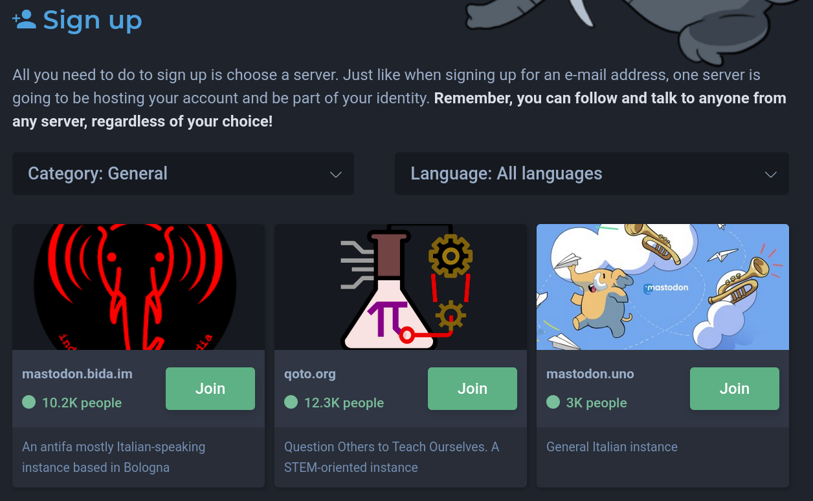
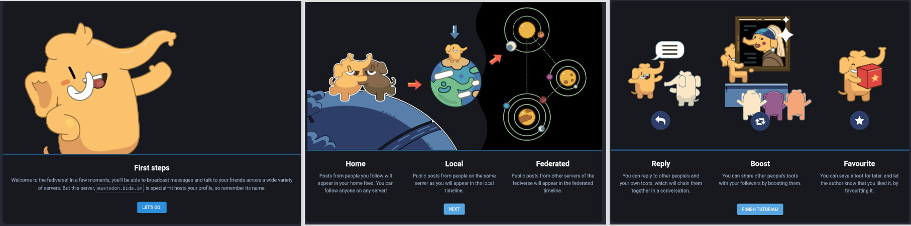
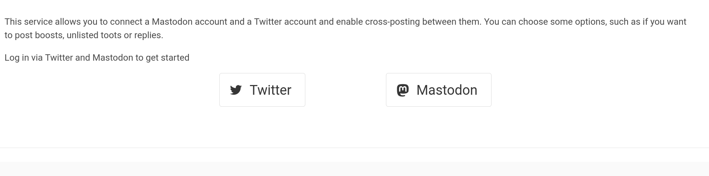

# What is Mastodon?
Straight from their main page: "Mastodon is an open source decentralized social network", 
so it's basically the project [Bluesky](https://twitter.com/bluesky) but already implemented 
(Without the ads yay). Basically, it's a bunch of small (compared to the whole thing) independent 
communities which can interact with each other. You can find more information about Mastodon and 
how it works in the [documentation](https://docs.joinmastodon.org/).

# Create an account
To create an account on Mastodon, you need to register to an instance (which can be self-hosted). 
Go straight to [joinmastodon](https://joinmastodon.org/), you have the most popular instances, 

You can select one instance, depending on your interests or whatever, note that it's not 
critical because you can always switch from one instance to another almost seemlessly.

# Getting started 
After email confirmation and a successful login to your newly created account, you're 
prompted with a little tutorial about how it works, TL;DR:

- You can talk to anyone on any server
- Tweet = Toot, Like = Favourite, Retweet = Boost, Reply = ... Reply

## Finding who to follow
Depending on the server you ended up choosing, you're automatically following the 
administrators of the instance, if you're lucky, they already toot (let's use the 
actual jargon) about interesting subjects for you, In any case, you'll quickly find 
the need to follow people more aligned with your interest, not only on your instance, 
there's [Trunk](https://communitywiki.org/trunk) which allows you to follow a bunch 
of people organized by Lists.

Going through this manually can be very tedious because in order to follow someone not 
on the same instance, you must enter your username and your domain, sometimes 
reauthenticate you mastodon account, just to follow someone! Fortunately, there's a 
script called [pytrunk](https://github.com/lots-of-things/pytrunk) which handles this 
gracefully, among others, it lets you check who on the lists are still active and how 
many followers they each have, and you only need to input your information once. By 
default it only works with Chrome, I had to [tweak it](https://github.com/RMPR/pytrunk)
a little bit to make it work with chromium.

## Setting a bridge to Twitter
If for one reason or another, you don't want to delete your Twitter account, you can 
use [Crossposter](https://crossposter.masto.donte.com.br/) to link Mastodon to Twitter

It's fairly straightforward, you just enter your accounts information, tweak the parameters 
if you're not satisfied with the defaults, and you're set.

# Mobile Clients
There are [several mobile clients](https://joinmastodon.org/apps) to access Mastodon, the 
most popular on Android being:
- [SubwayTooter](https://github.com/tateisu/SubwayTooter)
- [Tusky](https://github.com/tuskyapp/Tusky) (my daily driver)
- [Fedilab](https://github.com/stom79/Fedilab)

# Follow-up: Explore the Fediverse
Mastodon is just one of a community of federated platforms services built around the
ActivityPub protocol (among others, but currently the most widely adopted). Other open source 
social protocols can also communicate with ActivityPub projects. All together, they're 
forming the [Fediverse](https://fediverse.party/) = "Federation" + "universe"

