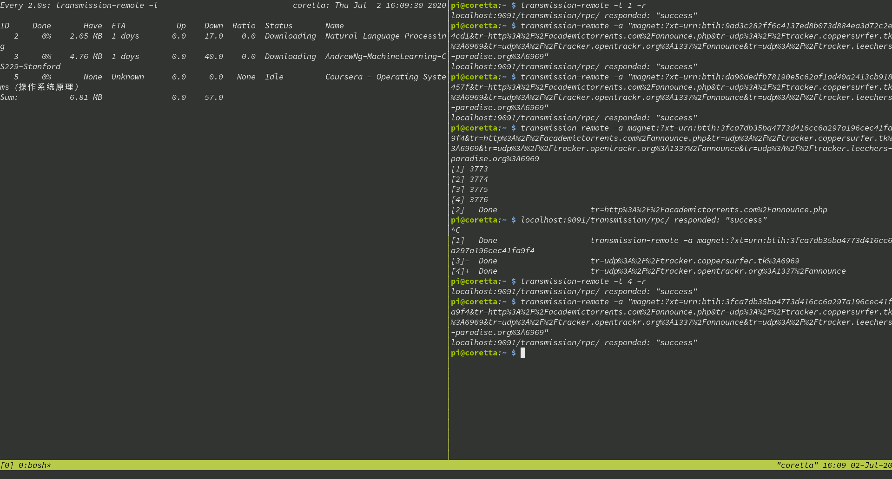

There are a lot of clients to manage torrents on your server: deluge, rtorrent, ... but I decided to settle with 
transmission, mainly because it's already installed in most of the distributions I had to manage and it provides 
a really handy daemon to manage all your downloads.

## Setting up
In case transmission is not already installed, you'll have to do it, on Debian and Fedora the packages of 
interest are: transmission-{remote,common,daemon}. Additionnaly, you'll also need tmux (I'll come back on this 
later). You may want to [run the daemon as your user](http://www.ephestione.it/change-user-of-transmission-daemon-under-debian-and-raspbian/), if for one reason or another you don't, you'll have to manually kill 
the transmission process and restart it after each reboot.

`sudo kill $(pgrep transmission) && transmission-daemon`

## Downloading torrents

The cli is pretty straightforward, when I mention CLI, I talk about transmission-remote, not transmission-cli. 
beware of using transmission-cli though, it has been deprecated in favor of transmission-remote, and it's less handy because it runs as a foreground process, so when you launch your torrents with transmission-cli, unless you 
add the ampersand (&) it will lock the current terminal (which is far from ideal if you're using ssh). The simple and modern command to add a new torrent is:

`transmission-remote -a /path/to/torrent/file`

Or if you have a magnet link:

`transmission-remote "<magnetlink>"`

Note the quotes when you want to add a magnet link, although not necessary all the time, I found some magnet 
links that simply didn't work without, so it's a good practice.
After that, you can verify everything is good with:

`transmission-remote -l`

## Keep track of what's happening
This is were tmux will be helpful, if you don't know what is tmux, [here](https://opensource.com/article/17/2/quick-introduction-tmux) is a quick introduction, for now you just have to launch tmux, then run the command:

`watch "transmission-remote -l" (add the -n flag to specify an interval, the standard is 2 seconds)`

Then Ctrl-B + % to divide the screen and you can now operate on transmisison as you wish, and you'll no longer have observability problems

## Rounding edges
You might experience connection slow down when launching torrents, it's because the torrent protocol is extremely 
efficient at maxing out your connection, so it uses all available resources to get the job done quicker. To "fix" that, you can limit download and upload speeds in  ~/.config/transmission/settings.json
