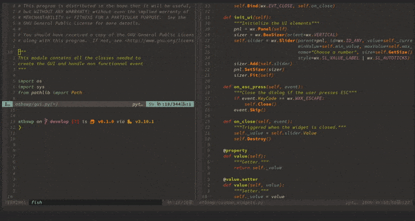

To preview images with neovim you can use the plugin [`telescope-media-files.nvim`](https://github.com/nvim-telescope/telescope-media-files.nvim) 
which is a [Telescope](https://github.com/nvim-telescope/telescope.nvim) extension.

To install with vim-plug, add the following lines to your config:

    Plug 'nvim-lua/popup.nvim'
    Plug 'nvim-lua/plenary.nvim'
    Plug 'nvim-telescope/telescope.nvim'
    Plug 'nvim-telescope/telescope-media-files.nvim'

This extension uses [Überzug](https://github.com/seebye/ueberzug) in the background, to install it on Fedora:

    # dnf copr enable tokariew/ueberzug

Note that this is a fork of the original COPR by frostyx because it has issues on Fedora 35. You can then install it:

    # dnf install -y ueberzug

To set up the plugin, all you need to do is to add

    require('telescope').load_extension('media_files')

In a lua file in your config. If you want to put it into a vimscript source file, you can write instead:

    lua << EOF
    require('telescope').load_extension('media_files')
    EOF

That&rsquo;s it, now you can preview images by running:

    :Telescope media_files

And voilà!

