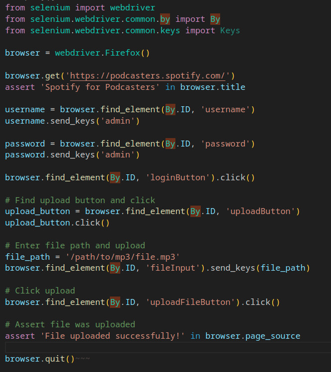
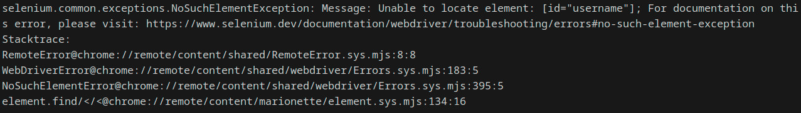

TL;DR This is a blog entry about me using
[cody](https://github.com/sourcegraph/cody) to write code with a python library
I wasn't familiar with.

All of this started with me wanting to send a bunch of audio files to Anchor,
and I discovering that it was not only bought by Spotify, but also it didn't
offer any API endpoint to send the audio files. I instinctively reached out to
Selenium, that I had never used before, and I (more importantly) didn't feel
like reading the documentation. This happened to be the day after I read [All
you need is Cody](https://about.sourcegraph.com/blog/all-you-need-is-cody) by
Steve Yegge. I think you see where this is going. I went ahead and fired up VS
Code (Cody's not yet fully available for Neovim 😢).

This was my first query:

> Create a python script using selenium to login to
> <https://podcasters.spotify.com/> with Firefox with the username "admin" and the
> password "admin" and upload a mp3 located on the harddrive

And it came up with the following code:

If for some reason you can't see that image correctly, here's the text:

    from selenium import webdriverfrom selenium.webdriver.common.by import Byfrom selenium.webdriver.common.keys import Keys
    
    browser = webdriver.Firefox()
    
    browser.get('https://podcasters.spotify.com/')
    assert 'Spotify for Podcasters' in browser.title
    
    username = browser.find_element(By.ID, 'username')
    username.send_keys('admin')
    
    password = browser.find_element(By.ID, 'password')
    password.send_keys('admin')
    
    browser.find_element(By.ID, 'loginButton').click()
    
    # Find upload button and click
    upload_button = browser.find_element(By.ID, 'uploadButton')
    upload_button.click()
    
    # Enter file path and upload
    file_path = '/path/to/mp3/file.mp3'
    browser.find_element(By.ID, 'fileInput').send_keys(file_path)
    
    # Click upload
    browser.find_element(By.ID, 'uploadFileButton').click()
    
    # Assert file was uploaded
    assert 'File uploaded successfully!' in browser.page_source
    
    browser.quit()

I felt a bit adventurous so I decided to run this after replacing the values of
the secrets with the correct ones. And unsurprisingly:

I had to play the game of prompting. Fast-forward a little bit, because I don't
want this to be too long, it took me 1 hour-ish to get a minimal working
version I could iterate on, which means, in practice the script could login and
start clicking around. If you look closely at the first version of the code,
you will notice that Cody got most of the steps right, and it was a matter of
actually providing a useful implementation, not a dummy thing that will throw
exceptions all over the place.

# The bad

At times, it's funky at best, just like when it tried to sell me that you could
upload files with the system dialog using selenium only. Full disclosure, it
was probably mislead by the
[documentation](https://www.selenium.dev/documentation/webdriver/elements/file_upload/),
so I don't know if I can hold that against Cody. Or when it hallucinates with
imports. Even if I was that familiar with the library, I'm pretty sure it would
have taken me quite some time to figure out the best way to go about it.

# The less bad

It will make you discover many things that might be some advanced features of
the library, that if you went the traditional way, would have only discovered
after becoming more familiar with the library.

# The good

Sometimes, the completion is so spot on, it almost feels like magic:

It's also quite good at writing XPath queries!

# The summary after a first exposure

You need practice with prompting, and that mastery only comes with experience.
All in all, it feels quite in line with how I think we should approach writing
software, or at least some of it. After all, I created [atbswp](https://atbswp.com) for exactly that
reason. One notable aspect of this is, the only thing I needed to motivate
myself to start that boring task is telling myself that the AI will write all of
the code for me.

Some people see it as the end for software engineers, I'd argue that with such a
system you need to know even more what you're doing. Or at least have pretty
good fundamentals. Overall, I find it to be an okay tradeoff. Reading the
documentation and figuring out the details by yourself is not obsolete yet, it's
just not the first thing you want to do (nor should do, to be fair). Maybe code
assistants were the solution we were waiting for to starve the spam clones of
Stackoverflow? We'll see. This is definitely a game changer, and it wouldn't be
wise to ignore it. To sum it up, we are not doomed quite yet, at best, in its
current stage, I would see this technology to be a sort of funky
pair-programming, or in the words of JHH in Software Defined Talk, it's a more
efficient Stackoverflow. Definitely excited to see what the future holds, and
the Neovim extension.

The final version of the code, that you can also find [here](https://github.com/RMPR/send-audio-to-anchor)

    import os
    from time import sleep
    import pyperclip
    from pynput.keyboard import Key, Controller
    
    from selenium import webdriver
    from selenium.webdriver.common.by import By
    from selenium.webdriver.support.wait import WebDriverWait
    from selenium.webdriver.support import expected_conditions as EC
    
    
    browser = webdriver.Chrome()
    
    browser.get('https://podcasters.spotify.com/pod/login')
    
    username = browser.find_element(By.ID, 'email')
    username.send_keys('email')
    
    password = browser.find_element(By.ID, 'password')
    password.send_keys('password')
    
    cookie_button = browser.find_element(By.ID, "onetrust-accept-btn-handler")
    cookie_button.click()
    # Find submit button with text "Login"
    submit_button = browser.find_element(By.XPATH, "//button[@type='submit']")
    
    sleep(5)
    submit_button.click()
    sleep(5)
    
    # Once logged in go to the upload page
    sleep(7)
    keyboard = Controller()
    for file_path in [mp3_file for mp3_file in os.listdir() if mp3_file.endswith('.mp3')]:
    	browser.get('https://podcasters.spotify.com/pod/dashboard/episode/wizard')
    	sleep(5)
    	file_input = browser.find_element(By.XPATH, "//button[@data-encore-id='buttonPrimary']")
    	file_input.click()
    	sleep(2)
    	# Needs to copy-paste here because of some limitations of pyautogui/pynput
    	pyperclip.copy(f"{file_path}")
    	with keyboard.pressed(Key.ctrl):
    		keyboard.press('v')
    		keyboard.release('v')
    	keyboard.press(Key.enter)
    	keyboard.release(Key.enter)
    	sleep(5)
    	file_path_without_extension = file_path.replace(".mp3", "")
    	title_input = browser.find_element(By.XPATH, "//input[@name='title']")
    	title_input.send_keys(file_path_without_extension)
    	episode_description = browser.find_element(By.XPATH, "//div[@role='textbox']")
    	episode_description.send_keys(file_path_without_extension)
    	publication_time = browser.find_element(By.XPATH, "//label[@for='publish-date-now']")
    	publication_time.click()
    	explicit_content = browser.find_element(By.XPATH, "//label[@for='no-explicit-content']")
    	explicit_content.click()
    	# Create a WebDriverWait to wait for the dialog
    	wait = WebDriverWait(browser, 420)
    	wait.until(EC.presence_of_element_located((By.XPATH, "//button[@data-encore-id='buttonSecondary' and text()='Replace']")))
    	submit_button = browser.find_element(By.XPATH, "//button[@data-encore-id='buttonPrimary']")
    	submit_button.click()
    	sleep(2)
    	submit_button = browser.find_element(By.XPATH, "//button[@data-encore-id='buttonPrimary']")
    	submit_button.click()
    	sleep(2)
    	submit_button = browser.find_element(By.XPATH, "//button[@data-encore-id='buttonPrimary']")
    	submit_button.click()
    	os.remove(file_path)
    	print(file_path, "deleted")
    	sleep(8)

